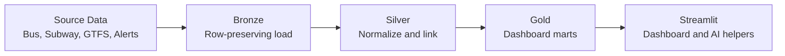
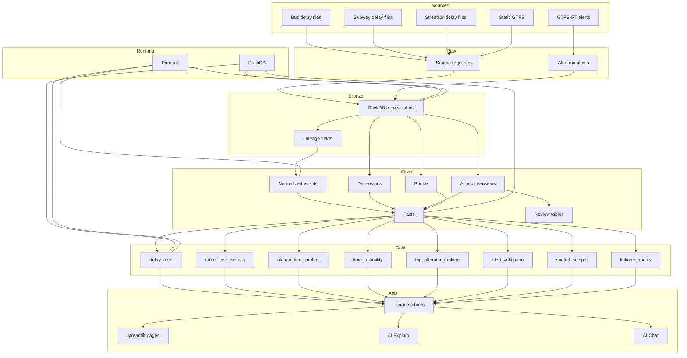

# TTC Pulse Architecture

## Purpose
System-level architecture for TTC Pulse: local-first transit reliability analytics using bus/subway delay logs, static GTFS, and GTFS-RT alerts. Streetcar and AI features exist as extensions; bus + subway + GTFS + alerts remain the core.

## Simple Diagram

## Detailed Diagram

## Layer Definitions
- Raw: registries/manifests for traceability.
- Bronze: row-preserving load into DuckDB with lineage.
- Silver: canonical modeling (events, dimensions, aliases, bridge, facts, review tables).
- Gold: presentation marts (rankings, trends, alert validation, spatial, linkage QA).

## Key Outputs
Silver: `fact_delay_events_norm`, `fact_gtfsrt_alerts_norm`, `dim_route_gtfs`, `dim_stop_gtfs`, `dim_route_alias`, `dim_station_alias`, `bridge_route_direction_stop`.

Gold: `gold_delay_events_core`, `gold_route_time_metrics`, `gold_station_time_metrics`, `gold_time_reliability`, `gold_top_offender_ranking`, `gold_alert_validation`, `gold_spatial_hotspot`, `gold_linkage_quality`.

## Runtime Summary
- DuckDB for SQL; Parquet for artifacts
- Streamlit for UI
- Local sidecar for GTFS-RT polling; 

